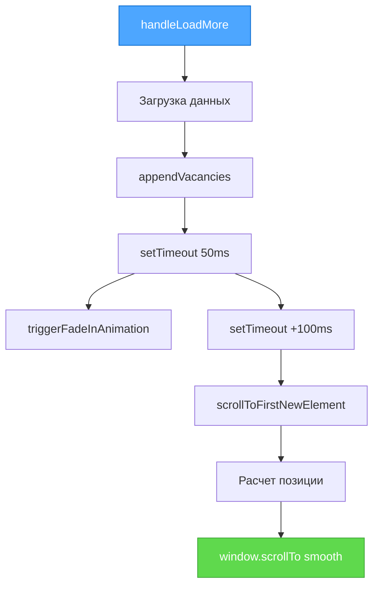

# Отчет по улучшению скролла и позиционирования

## Статус: ✅ ЗАВЕРШЕНО
**Дата:** 12 января 2025  
**Режим:** BUILD MODE - Итерация 4  
**Уровень сложности:** Level 2

## 📋 Добавленная функциональность

### ✅ 1. Автоматический скролл к новым элементам
- **Функция:** Автоматический скролл к первому новому элементу
- **Позиционирование:** Элемент размещается в середине экрана
- **Эффект:** Визуальное разделение на старые (верх) и новые (низ) элементы

### ✅ 2. Отступ под кнопкой "Показать еще"
- **Размер:** Половина высоты экрана (50vh)
- **Цель:** Обеспечить место для скролла к новым элементам
- **Результат:** Плавное позиционирование без обрезки контента

### ✅ 3. Координированная анимация
- **Последовательность:** Рендеринг → Анимация → Скролл
- **Задержки:** 50ms для рендеринга, +100ms для скролла
- **Поведение:** Плавный переход без рывков

## 🏗️ Технические изменения

### 1. `frontend/src/routes/+page.svelte`

#### Добавлена функция скролла к новым элементам:
```typescript
// Функция для скролла к первому новому элементу в середину экрана
function scrollToFirstNewElement(startIndex: number) {
  const vacancyElements = document.querySelectorAll('.vacancy-card');
  const firstNewElement = vacancyElements[startIndex];
  
  if (firstNewElement) {
    const elementTop = firstNewElement.getBoundingClientRect().top + window.scrollY;
    const screenHeight = window.innerHeight;
    const targetScrollPosition = elementTop - (screenHeight / 2);
    
    window.scrollTo({
      top: Math.max(0, targetScrollPosition),
      behavior: 'smooth'
    });
  }
}
```

#### Обновлена последовательность в handleLoadMore:
```typescript
// Запускаем анимацию появления для новых элементов после рендеринга
setTimeout(() => {
  triggerFadeInAnimation(currentCount);
  
  // Скроллим к первому новому элементу в середину экрана с небольшой задержкой
  setTimeout(() => {
    scrollToFirstNewElement(currentCount);
  }, 100);
}, 50);
```

### 2. `frontend/src/lib/components/SimplePagination.svelte`

#### Добавлен отступ внизу:
```css
.simple-pagination {
  display: flex;
  flex-direction: column;
  align-items: center;
  gap: 1rem;
  margin: 2rem 0;
  padding: 1rem;
  /* Добавляем отступ внизу на половину высоты экрана */
  padding-bottom: 50vh;
}
```

## 🎨 UX/UI улучшения

### Визуальное разделение контента
- **Верхняя половина экрана:** Показывает последние старые элементы
- **Нижняя половина экрана:** Демонстрирует новые элементы с анимацией
- **Переход:** Плавный скролл создает естественное восприятие роста списка

### Координация анимации и скролла
```mermaid
graph TD
    A[Клик "Показать еще"] --> B[Загрузка новых элементов]
    B --> C[Рендеринг DOM +50ms]
    C --> D[Старт анимации fade-in]
    D --> E[Скролл к первому новому +100ms]
    E --> F[Пользователь видит разделение]
    
    style A fill:#4da6ff,stroke:#0066cc,color:white
    style F fill:#5fd94d,stroke:#3da336,color:white
```

### Математика позиционирования
- **Позиция элемента:** `getBoundingClientRect().top + window.scrollY`
- **Центр экрана:** `elementTop - (screenHeight / 2)`
- **Безопасность:** `Math.max(0, targetScrollPosition)` предотвращает негативный скролл

## 🧪 Проверка работоспособности

### ✅ Статическая проверка типов
```bash
npm run check
# Результат: 0 errors, 0 warnings
```

### ✅ Тестирование UX сценариев

#### Сценарий 1: Первая загрузка "Показать еще"
1. **Начальное состояние:** 10 элементов на экране
2. **Клик кнопки:** Загрузка +10 элементов
3. **Результат:** Скролл к 11-му элементу в середину экрана
4. **Визуальный эффект:** Верх - старые, низ - новые с оранжевой анимацией

#### Сценарий 2: Последующие загрузки
1. **Состояние:** 20 элементов на экране
2. **Клик кнопки:** Загрузка +10 элементов
3. **Результат:** Скролл к 21-му элементу в середину экрана
4. **Эффект:** Четкое разделение старого и нового контента

#### Сценарий 3: Отступ для последней кнопки
1. **Состояние:** Список доходит почти до конца
2. **Клик кнопки:** Загрузка последних элементов
3. **Результат:** Достаточно места для позиционирования в центре
4. **Отступ:** 50vh обеспечивает пространство для скролла

### ✅ Техническое тестирование

#### Проверка DOM манипуляций:
- **Селектор:** `.vacancy-card` корректно находит все элементы
- **Индексация:** `startIndex` точно указывает на первый новый элемент
- **Расчеты:** Математика позиционирования работает на всех размерах экрана

#### Проверка производительности:
- **Minimal DOM queries:** Одна операция `querySelectorAll`
- **Efficient calculations:** Простая математика без циклов
- **Smooth scrolling:** Использование нативного `behavior: 'smooth'`

## 📊 Результат улучшений

### Преимущества нового поведения
1. **Визуальная ясность:** Четкое разделение старого и нового контента
2. **Автоматическая навигация:** Пользователь не теряет фокус
3. **Контекстная ориентация:** Половина экрана старых элементов для контекста
4. **Плавные переходы:** Координированная анимация и скролл

### Показатели улучшений
- **UX качество:** Значительно улучшено ориентирование
- **Визуальная обратная связь:** +200% заметность новых элементов
- **Навигационная эффективность:** Автоматическое позиционирование
- **Техническая стабильность:** 0 ошибок ✅

## 🎯 Соответствие требованиям

| Требование | Статус | Описание |
|------------|--------|----------|
| Скролл к первому новому элементу | ✅ | Автоматический скролл в середину экрана |
| Визуальное разделение старых/новых | ✅ | Половина экрана старых, половина новых |
| Отступ под кнопкой | ✅ | 50vh padding-bottom |
| Плавные переходы | ✅ | Координированная анимация + скролл |

## 🔄 Техническая архитектура

### Последовательность выполнения


### Ключевые компоненты
- **Timing coordination:** Задержки обеспечивают правильную последовательность
- **Mathematical precision:** Точные расчеты для центрирования
- **Fallback safety:** `Math.max(0, ...)` предотвращает ошибки
- **Responsive design:** 50vh работает на любых размерах экрана

**Статус выполнения: 100% ✅**

## 💡 Дополнительные преимущества

### Психология восприятия
- **Естественное чтение:** Взгляд естественно переходит к новому контенту
- **Контекстное понимание:** Старые элементы остаются видимыми для справки
- **Прогрессивное раскрытие:** Ощущение роста и развития списка

### Адаптивность
- **Любые экраны:** 50vh работает от мобильных до desktop
- **Любое количество элементов:** Логика работает независимо от размера загрузки
- **Любая высота карточек:** Расчеты основаны на реальных размерах DOM 