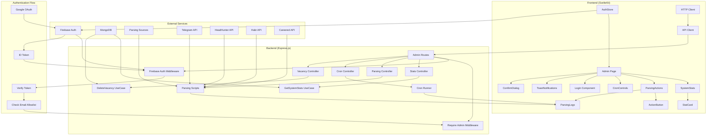

# JSPulse Admin Architecture

## Архитектурная диаграмма



## Компоненты системы

### Frontend Components

#### Основные страницы
- **Admin Page** (`/admin`) - главная страница админки
- **Login Component** - аутентификация через Google

#### UI компоненты
- **SystemStats** - отображение статистики системы
- **ParsingActions** - управление парсерами
- **CronControls** - управление планировщиком
- **ToastNotifications** - уведомления
- **ConfirmDialog** - диалоги подтверждения

#### Вспомогательные компоненты
- **StatCard** - карточка статистики
- **ActionButton** - кнопка действия
- **ParsingLogs** - логи парсинга

### Backend Components

#### Middleware
- **Firebase Auth Middleware** - проверка Firebase токена
- **Require Admin Middleware** - проверка прав администратора

#### Controllers
- **Stats Controller** - управление статистикой
- **Parsing Controller** - управление парсерами
- **Cron Controller** - управление планировщиком
- **Vacancy Controller** - управление вакансиями

#### Use Cases
- **GetSystemStats** - получение статистики
- **DeleteVacancy** - удаление вакансии
- **ClearCache** - очистка кэша

### External Services

#### Аутентификация
- **Firebase Auth** - аутентификация пользователей
- **Google OAuth** - провайдер входа

#### База данных
- **MongoDB** - хранение данных

#### Источники парсинга
- **HeadHunter API** - вакансии с hh.ru
- **Habr API** - вакансии с Habr Career
- **Telegram API** - вакансии из Telegram
- **Careered API** - вакансии через Careered

## Поток данных

### 1. Аутентификация
```
User → Google OAuth → Firebase Auth → ID Token → Backend → Verify → Allowlist Check → Access
```

### 2. Получение статистики
```
Admin Page → HTTP Client → API Client → Admin Routes → Stats Controller → GetSystemStats → MongoDB → Response
```

### 3. Запуск парсера
```
ParsingActions → HTTP Client → Admin Routes → Parsing Controller → Spawn Script → External API → MongoDB → Logs
```

### 4. Управление cron
```
CronControls → HTTP Client → Admin Routes → Cron Controller → Cron Runner → Scheduled Tasks
```

## Безопасность

### Аутентификация
1. **Google OAuth** - вход через Google
2. **Firebase ID Token** - JWT токен для API
3. **Token Verification** - проверка токена на сервере

### Авторизация
1. **Email Allowlist** - список разрешенных email
2. **Middleware Chain** - последовательная проверка прав
3. **Route Protection** - защита всех admin routes

### Защита данных
1. **HTTPS** - шифрование трафика
2. **CORS** - ограничение доменов
3. **Input Validation** - валидация входных данных

## Масштабирование

### Горизонтальное масштабирование
- **Load Balancer** - распределение нагрузки
- **Multiple Backend Instances** - несколько экземпляров бэкенда
- **Shared MongoDB** - общая база данных

### Вертикальное масштабирование
- **More CPU/RAM** - увеличение ресурсов
- **MongoDB Optimization** - оптимизация запросов
- **Caching** - кэширование данных

## Мониторинг

### Логи
- **Application Logs** - логи приложения
- **Parsing Logs** - логи парсинга
- **Error Logs** - логи ошибок

### Метрики
- **System Stats** - статистика системы
- **Performance Metrics** - метрики производительности
- **Health Checks** - проверки здоровья

### Алерты
- **Error Notifications** - уведомления об ошибках
- **Performance Alerts** - алерты производительности
- **Security Alerts** - алерты безопасности

## Развертывание

### Development
```bash
# Frontend
cd frontend && pnpm run dev

# Backend
cd backend && pnpm run dev

# MongoDB
docker-compose up mongodb
```

### Production
```bash
# Build
pnpm run build

# Deploy
docker-compose up -d

# Monitor
docker-compose logs -f
```

## Конфигурация

### Environment Variables
- **Firebase** - настройки аутентификации
- **MongoDB** - строка подключения
- **Admin Emails** - список администраторов
- **API Keys** - ключи внешних сервисов

### Feature Flags
- **Enable Parsing** - включение парсинга
- **Enable Cron** - включение планировщика
- **Debug Mode** - режим отладки

---

*Эта диаграмма показывает архитектуру админки JSPulse и взаимосвязи между компонентами.*
