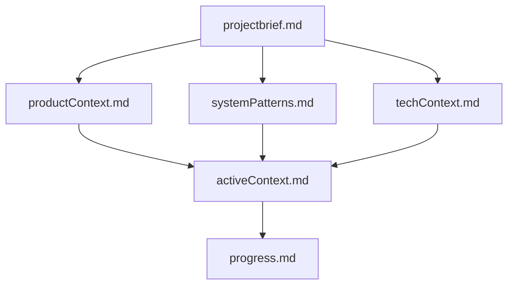
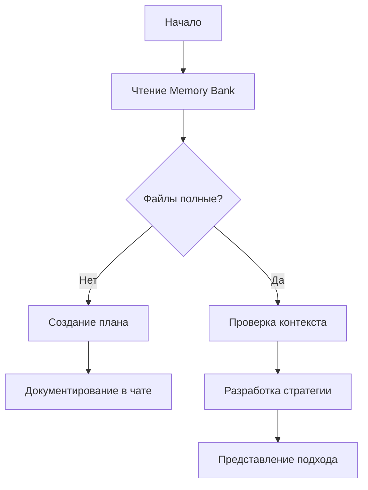
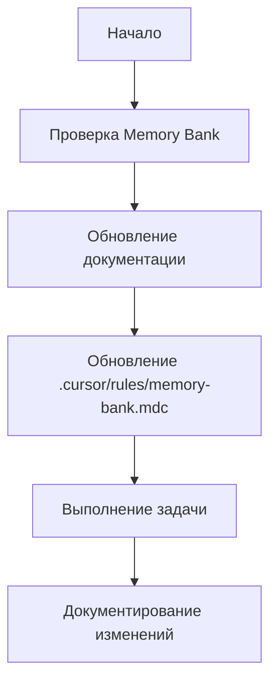

# 🧠 JSPulse Memory Bank

**Memory Bank** - это централизованная система документации и знаний проекта JSPulse, обеспечивающая непрерывность разработки и сохранение архитектурных решений между сессиями.

## 🎯 Назначение

Memory Bank решает ключевую проблему AI-ассистентов: **полную потерю памяти между сессиями**. Это единственный источник истины, который позволяет:

- 📚 **Сохранять контекст** - архитектурные решения, паттерны, правила
- 🔄 **Обеспечивать непрерывность** - продолжение работы с того места, где остановились
- 🏗️ **Поддерживать архитектуру** - соблюдение принципов и паттернов
- 📖 **Документировать эволюцию** - история принятых решений и их обоснование

## 🏗️ Архитектура Memory Bank

### **Иерархическая структура**


### **Core файлы (Обязательные)**
1. **`projectbrief.md`** - основа проекта, цели и требования
2. **`productContext.md`** - пользовательский контекст и задачи
3. **`activeContext.md`** - текущий фокус и активная работа
4. **`systemPatterns.md`** - архитектурные паттерны и решения
5. **`techContext.md`** - технологии, настройки, зависимости
6. **`progress.md`** - статус, что работает, что осталось

### **Дополнительные файлы**
- **`codeStyle.md`** - правила стиля кода и комментирования
- **`interactionRules.md`** - правила взаимодействия с AI
- **`mcpSetup.md`** - настройка MCP экосистемы
- **`tasks.md`** - текущие задачи и их статус
- **`projectStructure.md`** - детальная структура проекта и навигация
- **`quickReference.md`** - быстрая справка по ключевым файлам и командам

## 📚 Содержание файлов

### **projectbrief.md**
- **Цели проекта** - что мы строим и зачем
- **Основные требования** - функциональные и нефункциональные
- **Ограничения** - технические и бизнес-ограничения
- **Критерии успеха** - как понять, что проект завершен

### **productContext.md**
- **Проблема** - какую задачу решает проект
- **Пользователи** - кто будет использовать систему
- **User Journey** - как пользователи взаимодействуют с системой
- **Ключевые функции** - основной функционал

### **activeContext.md**
- **Текущий фокус** - над чем работаем сейчас
- **Последние изменения** - что было изменено недавно
- **Следующие шаги** - план дальнейших действий
- **Активные решения** - что обсуждается и решается

### **systemPatterns.md**
- **Архитектурные принципы** - Clean Architecture, SOLID
- **Паттерны проектирования** - Repository, DI, Factory
- **Структура проекта** - организация файлов и папок
- **Взаимодействие компонентов** - как части системы связаны

### **techContext.md**
- **Технологический стек** - что используем
- **Настройки окружения** - переменные, конфигурация
- **Зависимости** - внешние библиотеки и сервисы
- **Инструменты разработки** - сборка, тестирование, деплой

### **progress.md**
- **Что работает** - готовый функционал
- **Что в разработке** - текущая работа
- **Что осталось** - будущие задачи
- **Известные проблемы** - баги и ограничения

### **projectStructure.md**
- **Общая архитектура** - структура проекта и модули
- **Детальная навигация** - где найти конкретные файлы
- **Система аутентификации** - компоненты и конфигурация
- **Админ панель** - структура и API эндпоинты
- **Docker структура** - контейнеры и сервисы

### **quickReference.md**
- **Быстрый старт** - команды запуска и доступа
- **Ключевые файлы** - основные компоненты системы
- **Команды разработки** - frontend, backend, docker
- **Переменные окружения** - настройка аутентификации
- **Устранение неполадок** - частые проблемы и решения

## 🔄 Workflow использования

### **Режим планирования (Plan Mode)**


### **Режим выполнения (Act Mode)**


## 📝 Правила обновления

### **Когда обновлять Memory Bank**
1. **Открытие новой сессии** - всегда читать все файлы
2. **Завершение значимых изменений** - обновлять соответствующие файлы
3. **Изменение архитектуры** - обновлять systemPatterns.md
4. **Новые технологии** - обновлять techContext.md
5. **Завершение этапа** - обновлять progress.md

### **Команда "update memory bank"**
При получении команды **"update memory bank"**:
1. **Обязательно прочитать ВСЕ файлы** Memory Bank
2. **Проанализировать текущее состояние** проекта
3. **Обновить все файлы** в соответствии с актуальным состоянием
4. **Особое внимание** к `activeContext.md` и `progress.md`

## 🎯 Project Intelligence

### **Файл .cursor/rules/memory-bank.mdc**
Этот файл - **журнал обучения** для каждого проекта, содержащий:

- **Критические пути реализации** - как правильно делать вещи
- **Пользовательские предпочтения** - стиль работы и workflow
- **Проектные паттерны** - специфичные для проекта решения
- **Известные проблемы** - что может пойти не так
- **Эволюция решений** - как менялись подходы

### **Что захватывать**
- **Критические реализации** - сложные архитектурные решения
- **Пользовательские предпочтения** - как вы любите работать
- **Проектные паттерны** - специфичные для JSPulse решения
- **Известные вызовы** - что было сложно и как решили
- **Эволюция инструментов** - как менялись подходы к разработке

## 🚀 Практическое использование

### **Перед началом работы**
```bash
# 1. Прочитать все файлы Memory Bank
# 2. Понять текущий контекст
# 3. Определить следующие шаги
# 4. Следовать установленным паттернам
```

### **Во время работы**
```bash
# 1. Следовать архитектурным принципам
# 2. Использовать установленные паттерны
# 3. Обновлять документацию при изменениях
# 4. Логировать важные решения
```

### **После завершения**
```bash
# 1. Обновить progress.md
# 2. Записать новые паттерны в systemPatterns.md
# 3. Обновить activeContext.md
# 4. Сделать коммит с обновлениями
```

## 📊 Метрики эффективности

### **Покрытие документации**
- **Core файлы**: 100% заполнены и актуальны
- **Дополнительные файлы**: заполнены по необходимости
- **Обновления**: минимум раз в неделю или при изменениях

### **Качество документации**
- **Четкость** - понятно даже новому разработчику
- **Актуальность** - соответствует текущему состоянию
- **Практичность** - содержит конкретные примеры
- **Связность** - файлы дополняют друг друга

## 🔧 Технические детали

### **Формат файлов**
- **Markdown** - для лучшей читаемости
- **UTF-8** - поддержка русского языка
- **Структурированность** - четкие заголовки и разделы
- **Примеры кода** - практические примеры использования

### **Версионирование**
- **Git** - все изменения в системе контроля версий
- **Коммиты** - отдельные коммиты для обновлений Memory Bank
- **История** - отслеживание эволюции документации

### **Автоматизация**
- **Git hooks** - проверка актуальности документации
- **CI/CD** - автоматическая проверка ссылок и структуры
- **Linting** - проверка качества Markdown

## 🎯 Преимущества Memory Bank

### **Для разработчиков**
- **Быстрый старт** - понимание проекта за 5 минут
- **Консистентность** - соблюдение установленных паттернов
- **Эффективность** - меньше времени на понимание контекста
- **Качество** - следование лучшим практикам

### **Для AI-ассистентов**
- **Непрерывность** - продолжение работы с любого места
- **Контекст** - полное понимание проекта и архитектуры
- **Точность** - следование установленным правилам
- **Скорость** - быстрая адаптация к проекту

### **Для проекта**
- **Стабильность** - сохранение архитектурных решений
- **Масштабируемость** - четкие правила для новых участников
- **Поддерживаемость** - документация всех важных решений
- **Эволюция** - отслеживание развития проекта

## 🚨 Важные правила

### **Обязательные требования**
1. **Всегда читать Memory Bank** перед началом работы
2. **Обновлять документацию** при значимых изменениях
3. **Следовать установленным паттернам** без исключений
4. **Документировать решения** с обоснованием

### **Запрещено**
- **Игнорировать Memory Bank** - это единственный источник истины
- **Делать изменения** без понимания контекста
- **Нарушать архитектурные принципы** без обоснования
- **Оставлять документацию** в неактуальном состоянии

---

**Memory Bank - это не просто документация, это ДНК проекта JSPulse, обеспечивающее его успешное развитие и эволюцию!** 🧬✨ 