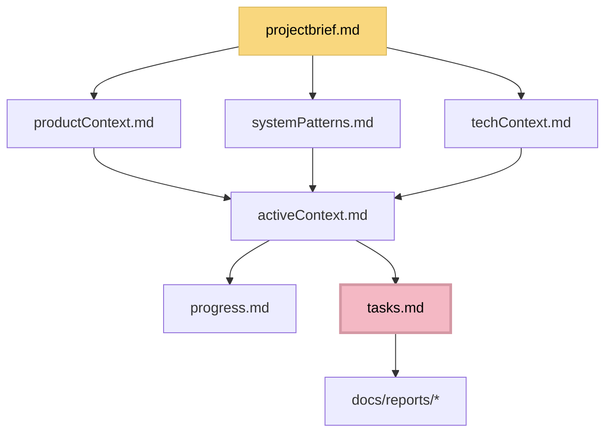

# Memory Bank - JSPulse Project

## 📚 Структура памяти проекта

Эта папка содержит всю информацию о проекте JSPulse для поддержания контекста между сессиями работы.

### 🏗️ Основные файлы Memory Bank

#### Core Files (Required)
1. **projectbrief.md** - Foundation document, основа всех остальных файлов
2. **productContext.md** - Зачем существует проект, какие проблемы решает
3. **systemPatterns.md** - Архитектура системы, ключевые технические решения
4. **techContext.md** - Технологии, development setup, ограничения
5. **activeContext.md** - Текущий фокус работы, недавние изменения, следующие шаги
6. **progress.md** - Что работает, что осталось построить, текущий статус
7. **tasks.md** - **SOURCE OF TRUTH** для всех задач проекта

#### Additional Context Files
- **codeStyle.md** - Стандарты кодирования и стиля
- **interactionRules.md** - Правила взаимодействия команды

### 📁 Документация (docs/)

#### docs/architecture-rules.md
Архитектурные правила проекта (запрет Magic Numbers, типобезопасность, etc.)

#### docs/reports/
Исторические отчеты о выполненных работах:
- **build-report*.md** - Отчеты по реализации пагинации и тестирования
- **refactoring-constants-report.md** - Отчет по устранению magic numbers
- **reflection.md** - Ретроспектива Level 2

#### docs/archive/
Архивные документы завершенных фаз проекта

## 🔄 Принцип работы

1. **Каждая сессия начинается** с чтения Memory Bank файлов
2. **tasks.md** - единственный источник истины для текущих задач
3. **activeContext.md** - отражает текущий фокус и состояние
4. **progress.md** - обновляется при значительных изменениях
5. **Новые отчеты** добавляются в docs/reports/

## 📋 Иерархия файлов

## ⚠️ Важно

- **НЕ УДАЛЯТЬ** core файлы без понимания последствий
- **tasks.md** всегда актуален и является источником истины
- **activeContext.md** обновляется при каждой значительной работе
- Исторические документы хранятся в docs/ для справки 